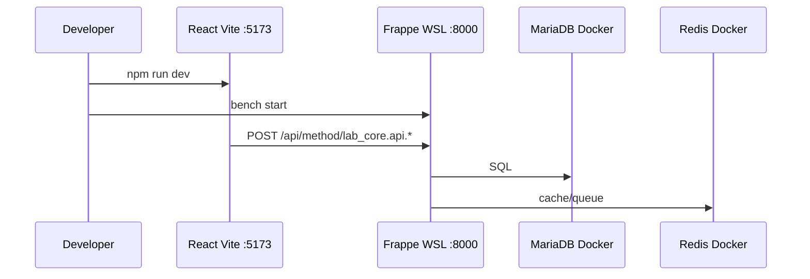

# LabProject — Arquitectura detallada

## Principios

1. **Linux-first:** Todo el runtime Frappe vive en WSL2 Ubuntu 24.04.
2. **Separación de concerns:** Datos (Docker), lógica ERP (Bench), UI (React).
3. **Escalabilidad modular:** Cada dominio de negocio = una app en `apps/`.
4. **Paridad producción:** Mismos servicios (MariaDB, Redis) que frappe_docker.

## Flujo de desarrollo



## Persistencia tras reinicio

- Contenedores Docker: `restart: unless-stopped`
- Volúmenes nombrados: `labproject-mariadb-data`, etc.
- Bench sites: `backend/frappe-bench/sites/` (local, gitignored)
- Código apps: `C:\LabProject\apps/` (versionado en Git)

## Perfiles Docker

| Perfil | Uso |
|--------|-----|
| (default) | Solo `db`, `redis-cache`, `redis-queue` |
| `full` | Incluye contenedor `frappe` con `bench start` |
| `backup` | Job mysqldump a `docker/backups/` |

## Autenticación React ↔ Frappe

**Desarrollo:** Cookie session tras login en Desk (same-site via proxy).

**Producción recomendada:**

- OAuth2 / API keys para integraciones
- JWT en API custom si se requiere SPA totalmente desacoplado en otro dominio
- CORS restringido a dominios conocidos (no `*` en prod)

## Roadmap de módulos

```
apps/
├── lab_core/       # Core APIs, shared DocTypes
├── lab_inventory/  # (futuro)
├── lab_crm/        # (futuro)
└── lab_reports/    # (futuro)
```

Cada app: hooks.py, DocTypes, APIs whitelisted, tests `bench run-tests`.
